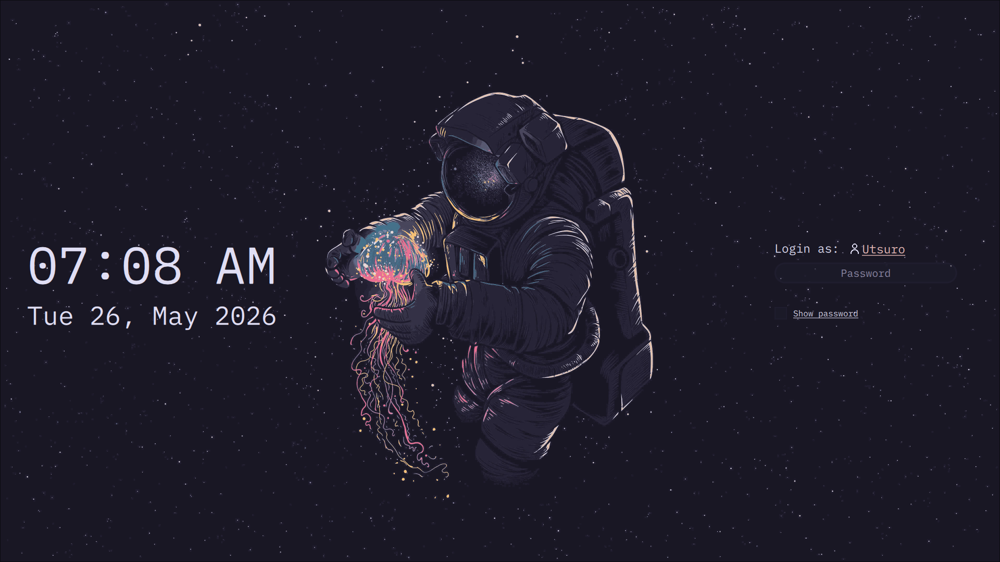
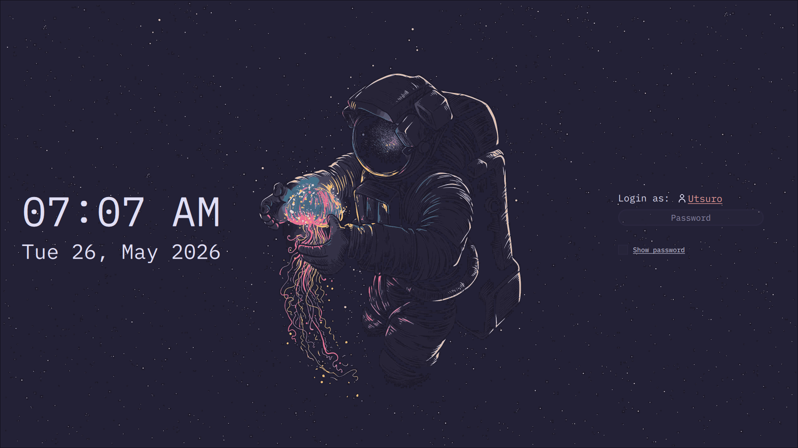
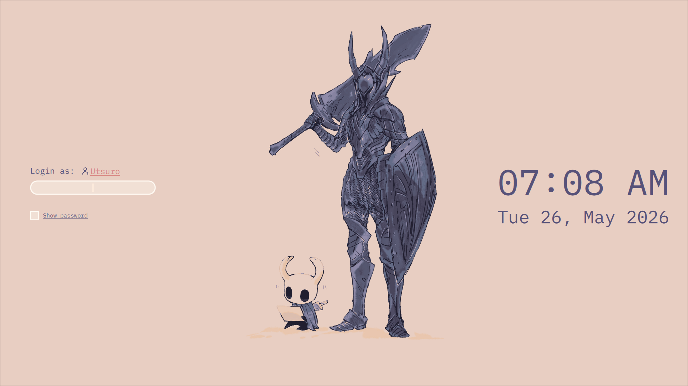

# About
A minimalist and functional theme for SDDM. 

## Colorscheme
By default the Rosé Pine theme is used (the `main` variant precisely),
but it can be easely changed, as many other properties. 
See: [`Customization`](#customization) for more details. 

## Screenshots 
* **Main**

* **Moon**

* **Dawn**

## Customization
The theme uses several config values, listed below. 
These can be modified at liking to obtain the look desired.

the following is a list of such properties with a brief explaination of each.
* `Backgrounds`: the path to the wallpaer. *Note:* the `path` must be accessible by sddm.
    For instance, something like `~/Pictures/wallpaper` won't work.

* `Variant`: if not null, it should specify the Rosé Pine variant to use.
Accepted values are `main, moon, dawn`, all other values are discarded and `main` will be used.

* `DeclareTheme`: set this to true to create a new theme, by providing a value for the following:
    - `NewBase`: the primary color (eg. background color for the wallpaer).
    - `NewSurface`: the secondary color.
    - `NewOverlay`: the tertiary color.
    - `NewText`: the texts color.
    - `NewSubtle`: the placeholder color.
    - `NewAccent`, `NewAccent2`, `NewAccent3`: the accent colors.

* `Font`: the font to use; *default*: `Lilex Nerd Font Mono`.
* `FontSize`: by default it gets computed by the theme, but can be overwritten at liking.
* `ForceFontSize`: set this to true to actually override the font size.

* `Locale`: override system locale.
* `HourFormat` and `DateFormat`: control how the time and date should be displayed.

* `FormPosition`: controls where the form, and the clock module should be shown.
    Accepted values are `rigth` and `left`.

* `Margins` and `Roundings`: override the default value for margins and roundings.

### Where are the system buttons and the session selector? 
Our idea of a minimalist theme leaves no space for visible elements besides the essential ones,
i.e. the form and clock. It is for this reason that both the system buttons and the session selector,
are shown when hovering the top and bottom part of the screen respectively. 
