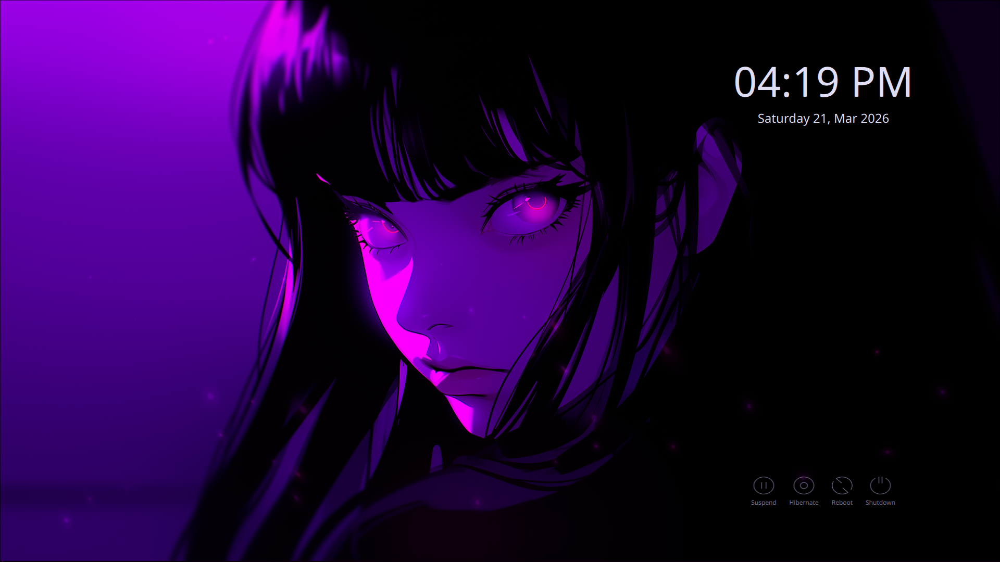

# ABOUT
This is a (WIP) custom theme for SDDM.

## Colorscheme
By default the Rosé Pine theme is used (the `main` variant precisely),
but it can be easely changed, as many other properties. 
See: [`Customization`](#customization) for more details.

## Screenshots
**Form Hidden.**

# ToDos
1. The form is there, but work is needed:
    - The layout must be fixed
    - The form, colors, and all the decorations are yet to be done
2. Add the options to change profile, session and keybor.
3. Make the theme customizable by simply editing the value in `theme.conf`
4. Details and optimizations
5. When [rose-pine-desktop-shell](https://github.com/UtsuroNoArashi/rose-pine-desktop-shell.git) is available, 
allow it to apply changes to the theme, as technically possible.

## Customization
Several values are used by the theme and can be modified at liking; 
the following is a list of such properties with a brief explaination of each.
* `Backgrounds`: the path to the wallpaer. *Note:* it must be accessible by sddm. For instance `~/Pictures/wallpaper` won't work

* `Variant`: if not null, it should specify the Rosé Pine variant to use.
Accepted values are `main, moon, dawn`, all other values are discarder and `main` will be used.

* `DeclareTheme`: set this to true to create a new theme, by providing a value for the following:
    - `NewBase`: the primary color (eg. background color for the wallpaer)
    - `NewSurface`: the secondary color 
    - `NewOverlay`: the tertiary color 
    - `NewText`: the texts color 
    - `NewSubtle`: the placeholder color 
    - `NewAccent`, `NewAccent2`, `NewAccent3`: the accent colors
